# Segment-Anything-U-Specify
Use SAM and CLIP model to segment unique instances you want.
You may use this repo to segment any instances in the picture with
text prompts.

The main network architecture is as follows:

`Clip Model Architecture`
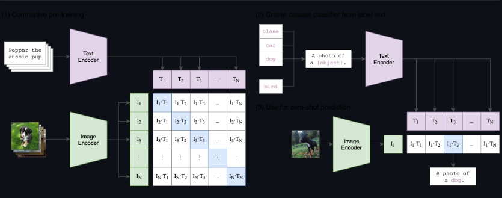

`SAM Model Architecture`
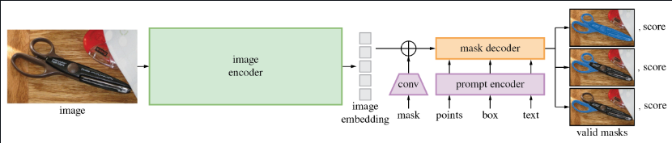

## Installation

Install python packages via commands:
```
pip3 install -r requirements.txt
```
Download pretrained model weights
```
cd PROJECT_ROOT_DIR
bash scripts/download_pretrained_ckpt.sh
```

## Instance Segmentation With Text Prompts
Instance segmentor first using sam model to get all obj's mask of the input image. Second using clip model to classify each mask with both
image features and your text prompts features.

```
cd PROJECT_ROOT_DIR
export PYTHONPATH=$PWD:$PYTHONPATH
python tools/sam_clip_text_seg.py --input_image_path ./data/test_images/test_bear.jpg --text bear
```

`Bear Instance Segmentation Result, Text Prompt: bear`
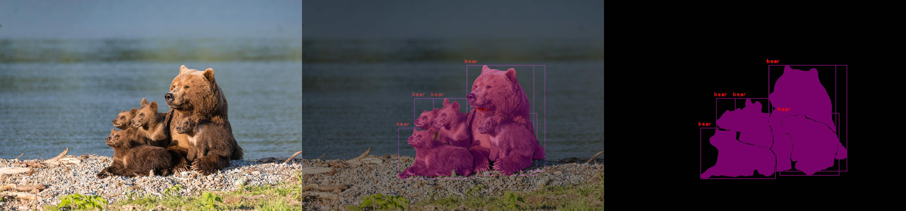

`Athelete Instance Segmentation Result, Text Prompt: athlete`
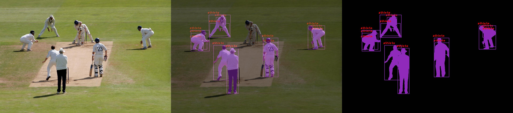

`Horse Instance Segmentation Result, Text Prompt: horse`
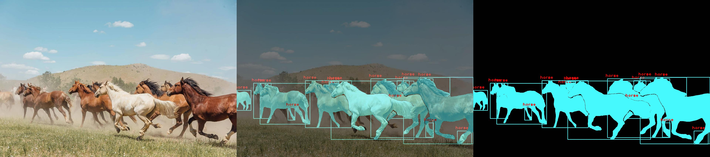

`Dog Instance Segmentation Result, Text Prompt: dog`
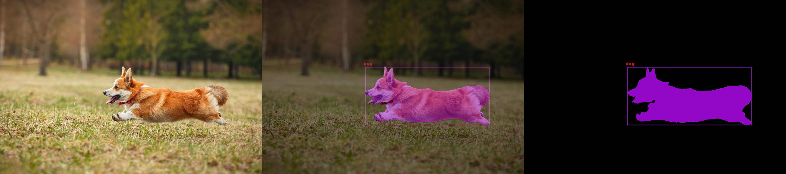

`Fish Instance Segmentation Result, Text Prompt: fish`
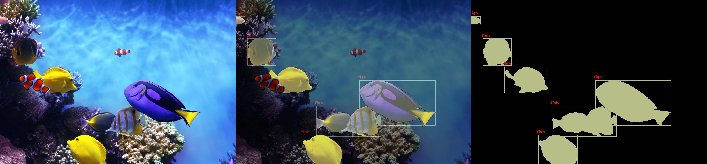

`Strawberry Instance Segmentaton Result, Text Prompt: strawberry`
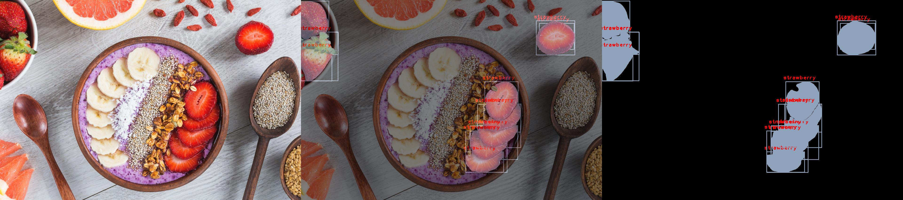

`Glasses Instance Segmentaton Result, Text Prompt: glasses`
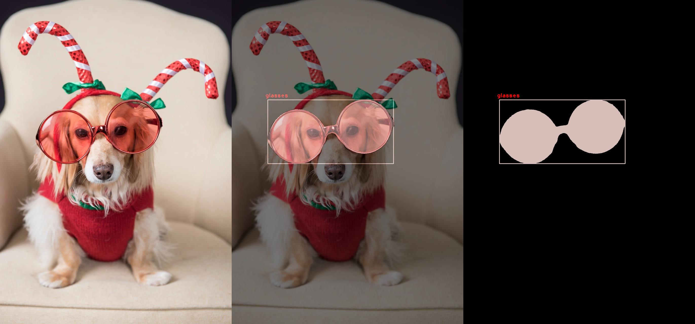

`Tv Instance Segmentaton Result, Text Prompt: television`
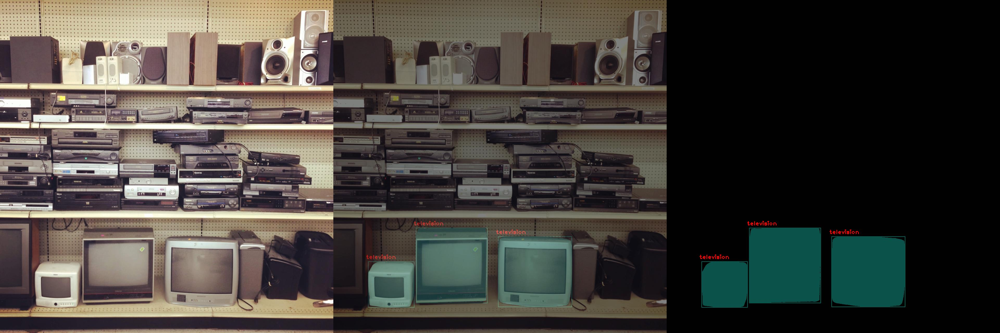

`Shoes Instance Segmentaton Result, Text Prompt: shoe`
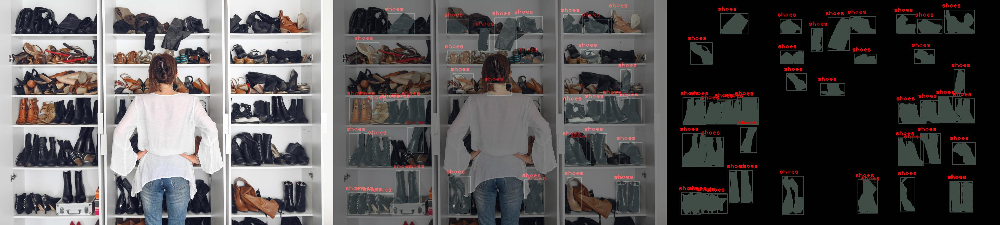

`Bridge Instance Segmentaton Result, Text Prompt: bridge`
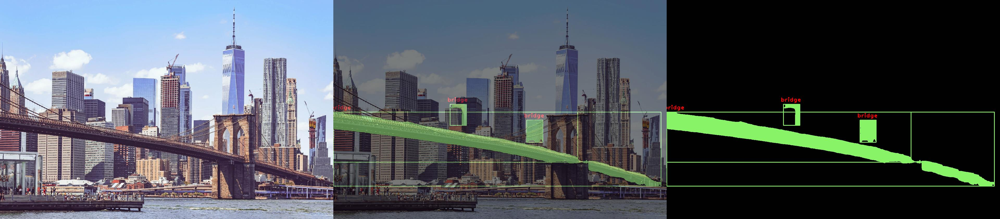

`Airplane Instance Segmentaton Result, Text Prompt: airplane`
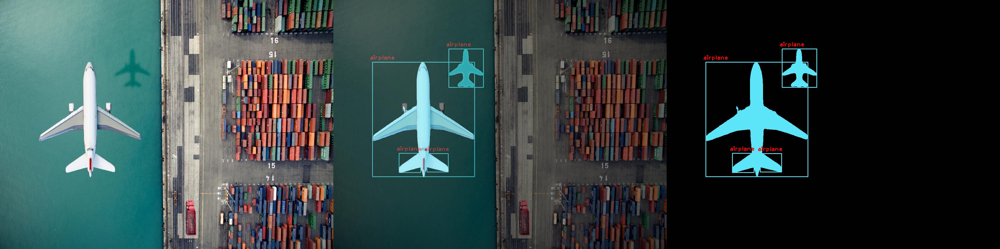

### Support Multiple Classes Segmentation All In Once ---- YOSO ---- You Only Segment Once
```
cd PROJECT_ROOT_DIR
export PYTHONPATH=$PWD:$PYTHONPATH
python tools/sam_clip_text_seg.py --input_image_path ./data/test_images/test_horse.jpg --text "horse,mountain,grass,sky,clouds,tree" --cls_score_thresh 0.5 --use_text_prefix
```

`Horse Instance Segmentation Result, Text Prompt: horse,mountain,grass,sky,clouds,tree`
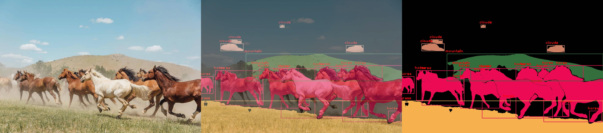
`Tv Instance Segmentaton Result, Text Prompt: television,audio system,tape recorder,box`
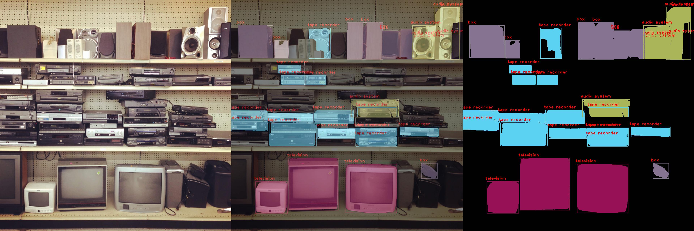
`Strawberry Instance Segmentaton Result, Text Prompt: strawberry,grapefruit,spoon,wolfberry,oatmeal`
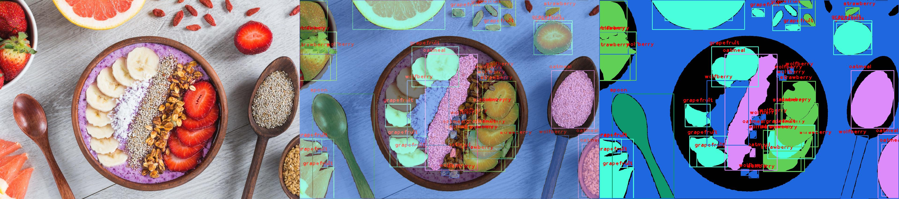
`Frog Instance Segmentaton Result, Text Prompt: frog,turtle,snail,eye`
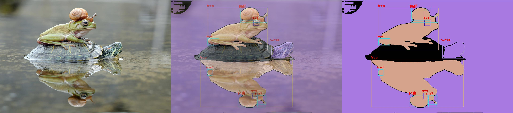

#### Instance Segmentation Provement

##### 2023-04-21 improve background segmentation problem

`Befor Optimize`
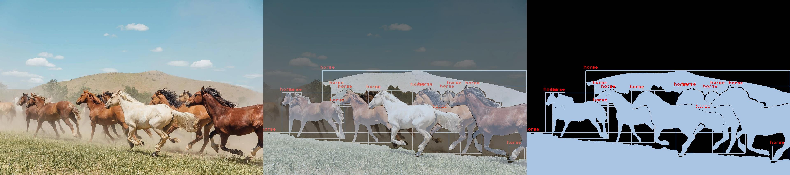
`After Optimize`


## Unsupervised Cluster Semantic Objects From SAM Model
Cluster first using sam model to get all obj's mask of the input image. Second using clip model to extract image features for each objects. Third calculate feature distance of every two object pairs. Finally using a similarity threshold to cluster source objects.

To test the cluster simply run

```
cd PROJECT_ROOT_DIR
export PYTHONPATH=$PWD:$PYTHONPATH
python tools/cluster_sam.py --input_image_path ./data/test_images/test_bear.jpg --simi_thresh 0.82
```

`Bear Cluster Result`


`Horse Cluster Result`
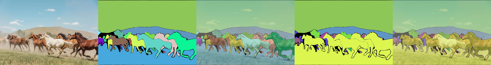

Each row represents `source image`, `sam origin mask`, `ori masked image`, `clustered mask`, `cluster masked image`

## UPDATES

### 2023-07-04 Integrate MobileSAM

Integrate MobileSAM into the pipeline for lightweight and faster inference. If you want to use mobile-sam to segment your
image all you need to do is to modify `./config/sam.yaml` file. Modify the model name field to `vit_t` and modify the 
model weight file path to `./pretrained/sam/mobile_sam.pt`

## TODO
- [x] Test different kinds of cluster method
- [x] Using cluster result as input prompts to reseg the image via sam model
- [ ] Merge embedding feats of global image and masked image

## Acknowledgement

Most of the repo's code borrows from opeai's clip repo and facebook's segment-anything repo:

- [CLIP](https://github.com/openai/CLIP)
- [segment-anything](https://github.com/facebookresearch/segment-anything)

## Star History

[](https://star-history.com/#MaybeShewill-CV/segment-anything-u-specify&Date)

## Visitor Count


## Contact

